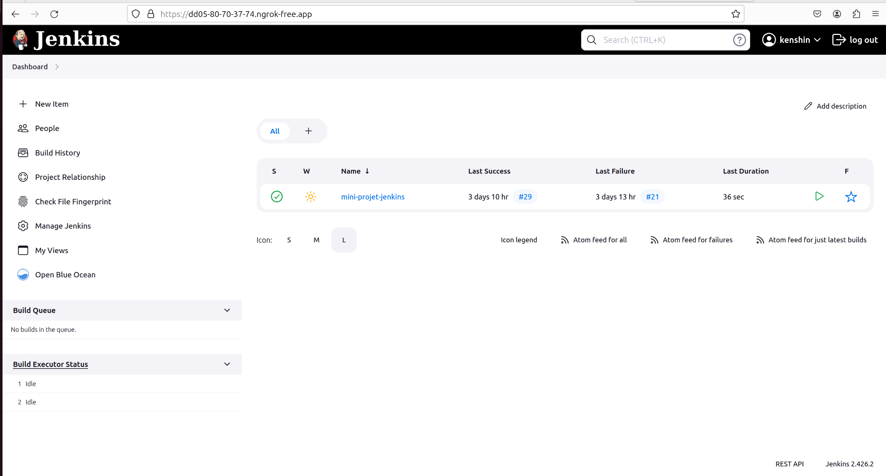
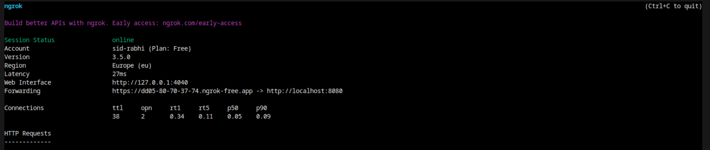
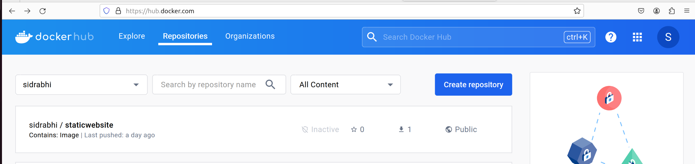
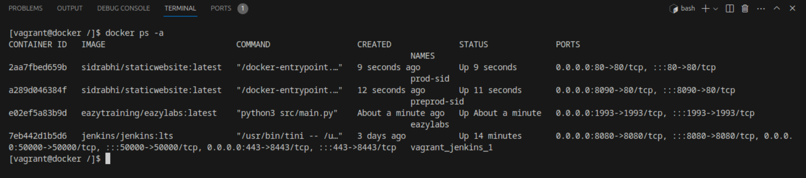
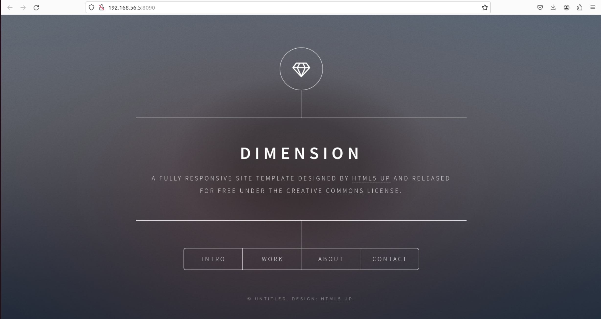

Auteur : Sid Ahmed Rabhi

Date : 06 janvier 2024

LinkedIn : https://www.linkedin.com/in/sid-ahmed-rabhi/

Portfolio : https://www.sid-rabhi.fr/

---

# Mini-projet Jenkins 2024

Ce projet Jenkins a été conçu pour automatiser les processus de construction, de test et de déploiement d'un site web statique disponible sur GitHub via le lien https://github.com/sid-rabhi/static-website-example/ .
Pour permettre l'intégration continue malgré un serveur Jenkins local, j'ai utilisé **Ngrok** pour exposer mon serveur Jenkins localement et lui attribuer une adresse IP publique. Un **Webhook** sur Github a été configuré pour déclencher automatiquement les workflows à chaque modification du projet, nécessitant cette adresse IP publique pour son bon fonctionnement.
De plus, des notifications sur **Slack** ont été intégrées dans le pipeline en utlisant ma propre libraire https://github.com/sid-rabhi/sid-slack-shared-library/ pour informer en temps réel des résultats des différents processus automatisés .
Pour les étapes de déploiement sur les environnements de staging et de production, j'utilise l'API Eazylabs https://github.com/eazytraining/eazylabs/ . 
Le fichier `Jenkinsfile` contient les étapes détaillées du pipeline, intégrant des processus de construction, de tests automatisés et de déploiement. Ce rapport fournit un aperçu complet du fonctionnement de chaque étape du pipeline, en mettant en évidence les avantages et les possibilités offertes par cette approche automatisée.

---

## Aperçu du pipeline CI/CD

---

# Étapes clés du Pipeline CI/CD 

1. **Construction de l'image Docker**
   - Génération de l'image Docker à partir du Dockerfile spécifié, utilisant la commande docker build pour assembler l'image conteneurisée du site web statique.
   
2. **Exécution du conteneur à partir de l'image construite**
   - Arrêt et suppression des conteneurs Docker existants pour garantir un environnement propre avant le lancement du nouveau conteneur.
   - Lancement du conteneur Docker basé sur l'image construite pour vérifier que l'application fonctionne correctement.

3. **Test de l'application**
   - *Vérification de l'application* : Effectue des tests via un curl pour valider le bon fonctionnement de l'application déployée.
   - *Nettoyage des conteneurs* : Arrêt et suppression du conteneur Docker utilisé pour les tests de l'application, assurant un environnement propre après l'exécution des tests.

4. **Envoi de l'image Docker vers Docker Hub**
   - *Authentification avec des credentials sécurisés* : Les identifiants requis pour accéder à Docker Hub sont gérés comme des credentials de type secret dans Jenkins. Ces informations d'identification sécurisées permettent d'authentifier et d'autoriser l'envoi sécurisé de l'image construite vers mon Docker Hub.
   - *Transfert de l'image* : Une fois l'authentification réussie, l'image Docker construite est transférée vers le registre Docker Hub.
   
5. **Déploiement sur STAGING**
   - Déploiement de l'application sur l'environnement de staging en utilisant l'API Eazylabs.

6. **Déploiement sur PRODUCTION**
   - Déploiement de l'application sur l'environnement de production en utilisant l'API Eazylabs lorsque la branche Git est 'origin/master'.

## Aperçu de Jenkins

## Aperçu de Ngrok

## Aperçu du Docker Hub

## Aperçu de Slack

## Aperçu des environnements 

## Aperçu du site

## Technologies utilisées

- *Jenkins* : Utilisé pour automatiser les étapes de CI/CD.
- *Docker* : Utilisé pour encapsuler l'application en conteneurs et simplifier le déploiement.
- *Ngrok* : Permet l'exposition d'un serveur Jenkins local en lui attribuant une adresse IP publique.
- *Docker Hub* : Plateforme de registre pour stocker et gérer les images Docker.
- *GitHub Webhook* : Déclenche automatiquement les workflows Jenkins à chaque modification du projet sur GitHub, assurant une intégration continue.
- *Slack* : Intégration pour les notifications en temps réel des résultats des processus automatisés.
- *API Eazylabs* : Employée pour le déploiement sur les environnements de staging et de production.

## Conclusion

Ce projet a démontré l'efficacité de l'automatisation des processus de CI/CD à l'aide d'outils tels que Jenkins, Docker, Ngrok, Slack et GitHub Webhook. L'intégration continue, les tests automatisés et les déploiements ont été orchestrés de manière fluide, garantissant ainsi une approche fiable pour la construction, les tests et le déploiement de l'application. L'utilisation de ces technologies a facilité la gestion des environnements et des déploiements, assurant la disponibilité et la qualité de l'application déployée.
