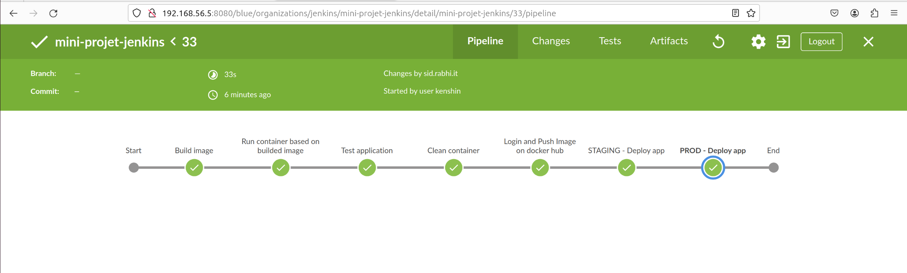

# Mini-projet Jenkins

Dans ce projet, j'ai conteneurisé un site web statique disponible sur mon Github sous le lien https://github.com/sid-rabhi/static-website-example/ et j'ai mis en place un pipeline de CI/CD sur mon GitLab https://gitlab.com/sid-rabhi/staticwebsite pour automatiser les étapes de construction, de test et de déploiement de l'application sur Heroku. Ce rapport explique les étapes du pipeline que vous trouverez dans le fichier `.gitlab-ci.yml`, et les avantages de cette approche.

---

Auteur : Sid Ahmed Rabhi

Contexte : formation Bootcamp DevOps promotion 16

Centre de formation : Eazytraining

Période : novembre-décembre-janvier

Date : 06 janvier 2024

LinkedIn : https://www.linkedin.com/in/sid-ahmed-rabhi/

## Aperçu du pipeline CI/CD

